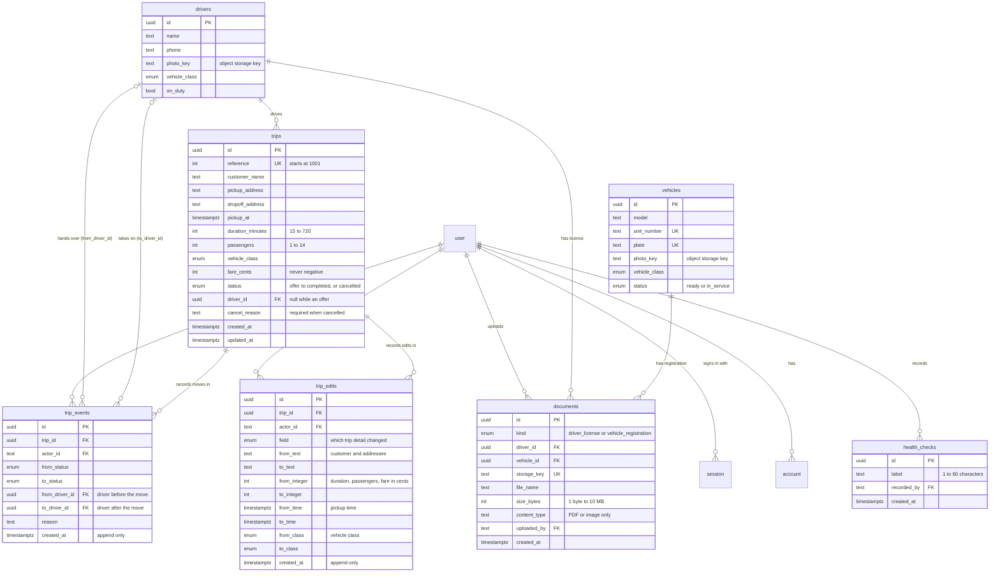
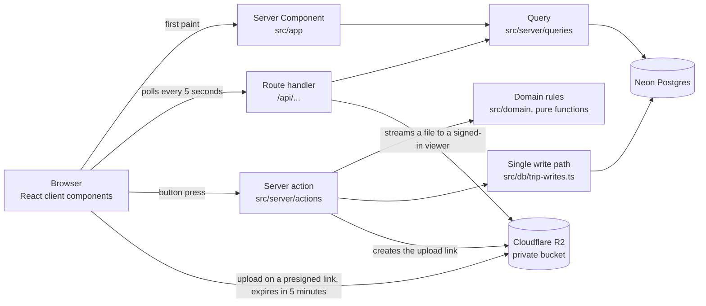

# Dispatch Lite

Dispatcher operations app for a luxury car service: trips, driver matching, drivers, fleet, a day schedule and private documents, all updating live. "What was asked, and where it is" maps every requirement to the code, and "Where to look in the code" is the map for reading it.

## Setup

Requirements: Node 22.19 or later, pnpm 10, and Postgres 16 running locally (the `btree_gist` and `pg_trgm` extensions ship with standard Postgres). Nothing else: file storage runs in-process on your machine for development.

```
pnpm i
cp .env.example .env
```

Set `BETTER_AUTH_SECRET` in `.env` to a random value (`openssl rand -base64 32`), set `DEMO_USER_PASSWORD` to a password of your choosing, and point `DATABASE_URL` at your Postgres if it is not `postgres:postgres@localhost:5432`. Then:

```
pnpm db:reset
pnpm dev
```

Open http://localhost:3000 and sign in as dispatcher@example.com with the password you set in `DEMO_USER_PASSWORD`.

| Variable | What it is | Local value |
|---|---|---|
| `DATABASE_URL` | Postgres connection string | Your local Postgres |
| `BETTER_AUTH_SECRET` | Signs sign-in sessions. Different in every environment | `openssl rand -base64 32` |
| `BETTER_AUTH_URL` | The app's own address | `http://localhost:3000` |
| `APP_TIMEZONE` | The business's time zone, which decides what "today" means | `America/New_York` |
| `DEMO_USER_EMAIL`, `DEMO_USER_PASSWORD` | The demo account the seed creates and keeps in step | Your choice |
| `STORAGE_ENDPOINT`, `STORAGE_BUCKET`, `STORAGE_ACCESS_KEY_ID`, `STORAGE_SECRET_ACCESS_KEY` | S3 compatible file storage | Leave the defaults for the local store |
| `CRON_SECRET` | Lets the daily demo-day job run (16 characters or more) | Leave empty |
| `SENTRY_DSN`, `NEXT_PUBLIC_SENTRY_DSN`, `SENTRY_ORG`, `SENTRY_PROJECT`, `SENTRY_AUTH_TOKEN` | Error and trace reporting, optional | Leave empty |
| `NEXT_PUBLIC_VERCEL_ENV` | Set by Vercel | Leave empty |

`pnpm db:reset` recreates the local database, applies migrations and seeds a week of fake trips. It refuses to run against anything other than localhost. `pnpm dev` also starts a local S3 compatible store on port 4568 for uploads; files land in `.storage/`.

For a load check, `pnpm db:reset --load` starts over with 100,000 extra historical trips (about two minutes), and `pnpm verify <flow> --load` measures a flow against them. Results are under "Load test" below.

## Checks

```
pnpm lint && pnpm typecheck && pnpm test && pnpm e2e
```

Integration tests use a separate `dispatch_test` database and e2e tests use `dispatch_e2e`. Both are recreated on every run. The e2e tests need Playwright's Chromium once: `pnpm exec playwright install chromium`.

GitHub Actions (`.github/workflows/ci.yml`) runs lint and typecheck, unit, integration and end to end tests on every push to every branch, so each pull request shows its result. Mutation testing on `src/domain` takes about half an hour, so it runs only when started by hand from the Actions tab.

## Where everything is hosted and stored

| What | Where | Notes |
|---|---|---|
| Code and history | GitHub, this repository | Pull request per change |
| Checks | GitHub Actions | See "Checks" above |
| The app | Vercel, project `dispatch-lite` | Production at https://dispatch-lite-ruby.vercel.app from `main`, a preview per branch |
| Database | Neon Postgres, project `dispatch-lite` | Branches `main` (production), `preview` and `local-dev` |
| Files: licences, registrations, driver and vehicle photos | Cloudflare R2, buckets `dispatch-lite-production` and `dispatch-lite-preview` | Private; served only through the app |
| Secrets and settings | Vercel environment variables, per environment | Nothing secret is in the repo; names are in `.env.example` |
| Errors and slow requests | Sentry | New error and regression alerts |
| Uptime | Better Stack | Checks `/login` every 3 minutes and `/api/health` every 15 minutes |
| Scheduled job | Vercel Cron, `vercel.json` | Rolls the demo day forward at 09:05 UTC |

## Environments and storage

Three separate environments, each with its own database and its own files, so a mistake in one cannot touch another.

| Environment | Where it runs | Database | Files |
|---|---|---|---|
| Production | `main` on Vercel | Neon branch `main` | R2 bucket `dispatch-lite-production` |
| Preview | every other branch on Vercel, behind Vercel login | Neon branch `preview`, a copy of production data | R2 bucket `dispatch-lite-preview` |
| Local | your machine | local Postgres | in-process S3 on your machine |

Each environment also has its own sign-in secret, so a session from one is useless in another. Previews sign in on their own address, which the app reads from Vercel. A branch per preview needs the Neon integration for Vercel (https://vercel.com/integrations/neon); until it is installed all previews share the one `preview` branch, still isolated from production.

Documents are private. Both buckets have public access switched off and no custom domains, so a file cannot be reached by its address alone. Viewing a file always goes through the app: it checks the person is signed in on every request and streams the file itself, so there is no file address to copy and share, and a signed-out request is refused with a 401. None of these files go through a shared CDN cache, because a shared cache would hand a private file to anyone with its address. Driver and vehicle photos are cached by the viewer's own browser for an hour (each new photo gets a new address, so a change shows at once); licences and registrations are never cached. The app's own scripts, styles and fonts are served from Vercel's CDN. Uploads go straight from the browser to the bucket on a signed link that expires after 5 minutes, handed out only to signed-in users. Upload limits (PDF or image, 10 MB) are enforced by the app and again by the database.

## Backups and restoring

The database keeps a running record of every change for the last 7 days. If someone deletes the wrong data, or a bad release scrambles it, the database can be rewound to any second inside that window. Nothing has to be unpacked from a backup file, and the rewind takes seconds.

| Data | Where it lives | How it is protected | How far back |
|---|---|---|---|
| Trips, drivers, vehicles, document records, accounts, sessions, history | Neon Postgres, one branch per environment | Continuous change history, restorable to any second | 7 days |
| Uploaded files (licences, registrations, photos) | Cloudflare R2, private buckets | Stored redundantly by R2. R2 has no undelete, so a deleted file is gone | Not restorable |
| Code and configuration | GitHub and Vercel | Full commit history, redeploy any commit | Unlimited |

### Restoring production

Use the Neon console; it is the safer choice under pressure.

1. Open the Neon project `dispatch-lite`, choose Branches, then `main`.
2. Press Restore and pick the time just before the damage. If unsure, first create a branch from `main` at that time ("from a past point in time") and check the data there. Such a branch is a free, isolated copy.
3. Confirm. Neon keeps the pre-restore state in a branch called `main_old_<timestamp>`, so a restore can itself be undone.
4. Reload the app. Check `/api/health` reads `"database":"ok"`, sign in and look at the dashboard.
5. Delete the `main_old_...` branch once you are sure.

A restore rewinds everything on that branch, including bookings made after the restore point and sign-in sessions, so tell the dispatchers which time you restored to.

### Restore drill

Done on 2026-10-08 on a throwaway copy, never on production.

| Step | What happened | Time |
|---|---|---|
| 1 | Created branch `restore-drill` from `main` | 1.0 s |
| 2 | Counted the data: 12 vehicles, 10 drivers on duty, 281 trips | |
| 3 | Noted the restore point from the database clock: 2026-10-08 15:54:49 UTC | |
| 4 | Simulated a disaster: deleted all 12 vehicles and took all drivers off duty | |
| 5 | Restored the branch to the noted time, keeping a copy of the damaged state | 3.0 s |
| 6 | Counted again: 12 vehicles, 10 drivers on duty, 281 trips, identical to step 2 | |

The whole drill took 23 seconds, and both drill branches were deleted afterwards. Repeat it monthly and after any change to how the database is hosted.

## Deploying

Vercel builds with `pnpm db:deploy && pnpm build`. `db:deploy` applies migrations, then seeds the fake demo data if the database has no drivers yet. On a database that already has data it rolls the demo day forward instead: trips left open on earlier days are finished or cancelled through the normal status rules (each move is in the activity log), and if today has no trips a fresh day is added in every status. Nothing is deleted, so it is safe on every deploy. A Vercel cron job (`vercel.json`) does the same every morning at 09:05 UTC through `/api/cron/demo-day`, which only runs when the request carries the `CRON_SECRET` bearer token; set `CRON_SECRET` on the Vercel project (16 characters or more) to switch it on. It also keeps the demo account's password in step with `DEMO_USER_PASSWORD`: change the variable and redeploy, and the old password stops working and everyone signed in with it is signed out. The demo password lives only in that variable and in the submission message; the app never reads it and the sign in page never shows it. Set the variables from `.env.example` on the Vercel project, plus `SENTRY_DSN` and `NEXT_PUBLIC_SENTRY_DSN` if you want error and trace reporting.

## Running cost

Estimated from public vendor pricing read on 2026-10-08 (prices change, so check before quoting). Totals per month, with the range in brackets:

- 20 users (about 5 dispatchers online at once): **about $30** ($30 to $93)
- 200 users (about 40 online at once): **about $152** ($92 to $297)
- Idle demo with almost no traffic: **about $27** ($0 to $28)

The biggest drivers are the Vercel Pro fee, Neon compute that polling keeps awake during shifts, and Sentry spans from tracing every 5 second poll at 100 percent (deliberate for now). Once real traffic arrives, lowering the trace sampling rate brings the 200 user figure down to about $55. The 15 minute interval on the database health check already saves about $10 a month compared with checking every 3 minutes. How the figures were built is under "How the estimate was built" below.


### In plain terms

Think of running the app like running a small office. Five services keep it going, and most of the bill is two of them.

| Service | What it is, in office terms | 20 users | 200 users |
|---|---|---|---|
| Vercel | The building the app lives in, and the staff who serve every page | $20 | $40 |
| Neon | The filing cabinet that holds every trip, driver and booking, with a rewind button | about $10 | about $15 |
| Cloudflare R2 | A locked safe for licences, registrations and photos | $0 | $0 |
| Sentry | A smoke alarm that tells us when something breaks and how slow pages are | $0 | about $97 |
| Better Stack | A doorbell check every few minutes that the site is open | $0 | $0 |
| **Monthly total** | | **about $30** | **about $152** |

How to read it:
- **A quiet demo costs about $27 a month.** Almost all of that is the building and the filing cabinet.
- **The jump at 200 users is almost all the smoke alarm.** It records every refresh of every screen. Telling it to record one refresh in ten, which we would do once real traffic arrives, brings the 200 user bill to about $55.
- **Files are almost free.** The safe stays free until it holds about 10 GB, which is tens of thousands of documents. Because files are now handed out by the app rather than straight from the safe, each view also counts toward Vercel's data transfer: about $1.60 a month at 200 users if each dispatcher loads every photo once a day, and up to about $13 if every photo is reloaded every hour of a shift.
- **A 100,000 trip history is tiny.** Measured at 195 MB with its full status history, which costs a few cents a month.
- **Not included:** the one time build fee, a web address of your own (about $12 a year), and any extra seats for people who deploy changes.

These are estimates from the vendors' public price lists on 2026-10-08. Prices change, so check before quoting.

### How the estimate was built

| Service | Plan | 20 users | 200 users | Idle demo | Main cost driver |
|---|---|---|---|---|---|
| Vercel | Pro | $20 | $40 | $20 | Platform fee. At 200 users polling passes 1 million requests, which adds the $20 CDN capacity tier |
| Neon Postgres | Launch | $10.14 | $14.98 | $6.98 | Compute hours: awake all shift because of polling, and a third of off-shift time because of the 15 minute health check |
| Cloudflare R2 | Pay as you go | $0 | $0 | $0 | Inside the free tier, and R2 charges nothing for downloads |
| Sentry | Developer, Team at 200 users | $0 | $97.14 | $0 | Spans: every poll is traced at 100 percent |
| Better Stack Uptime | Free | $0 | $0 | $0 | 2 monitors fit inside the free 10 |
| **Total** | | **$30.14** | **$152.12** | **$26.98** | |

The usage comes from the code, not guesses about traffic:

- Every open tab polls every 5 seconds (`POLL_INTERVAL_MS` in `src/components/live-query.ts`), so 720 requests an hour. Polling pauses in hidden tabs.
- A shift is 8 hours, 22 days a month. 5 dispatchers online at once at 20 users and 40 at 200 users gives 880 and 7,040 tab hours a month, so about 0.63 million and 5.1 million polls.
- Each poll checks the session and runs 1 to 3 SQL queries. Traces are sampled at 100 percent (`src/observability.ts`), about 7 spans per poll.
- `/api/health` is checked every 15 minutes and reads the database, so the database can sleep between checks. `/login` is checked every 3 minutes and does not touch the database.
- Files are streamed through the app after a sign-in check, so file views count as Vercel transfer at $0.06 per GB. With about 30 photos of about 1 MB, 40 dispatchers loading each once a day is about 26 GB, or $1.58 a month. Reloading every photo every hour is about 211 GB, or $12.67. That is not in the totals above.

The range: low assumes 0.6 times the open tab hours, fewer spans per poll and a smaller database; high assumes 1.5 times the tab hours, more spans per poll, a bigger database and more memory per function. The idle demo low of $0 assumes free plans everywhere, which a commercial client cannot use. Taxes are not included.

What would make the bill jump:

1. **Trace sampling at 100 percent.** Spans cost $2 per million past the first 5 million, and this setting is about two thirds of the 200 user bill. Sampling polls at 10 percent brings that bill to about $55.
2. **The polling interval.** Halving the rate halves function calls, transfer and spans.
3. **A database that never sleeps.** Anything that touches the database more often than every 5 minutes stops Neon from suspending. A 3 minute health check would add about $10 a month.
4. **Vercel's CDN tiers.** Free to 1 million requests, then $20 to 10 million, then $100 to 50 million. The 200 user high case (9.4 million) is close to the next step.
5. **People online at once, not total users.** 200 users who log in once a day cost almost nothing; 40 watching the dashboard all shift cost the whole bill.

The assumptions most likely to be wrong are the spans per poll (3 would make the 200 user Sentry bill about $51, 12 would make it about $155), how many dispatchers are online at once, and how long Neon's compute stays awake. Neon's monitoring page after a quiet weekend should show about 5 minutes awake in every 15.

Sources, all read on 2026-10-08: vercel.com/pricing, vercel.com/docs/plans/pro-plan, vercel.com/docs/pricing/flat-rate-cdn, vercel.com/docs/functions/usage-and-pricing, neon.com/pricing, neon.com/docs/introduction/plans, neon.com/docs/introduction/scale-to-zero, developers.cloudflare.com/r2/pricing, sentry.io/pricing, docs.sentry.io/pricing, betterstack.com/pricing. Not confirmed on any page: whether Vercel's usage credit covers the CDN tier, and how Sentry counts spans per request.

## Load test: 100,000 trips

`pnpm verify dashboard jobs-search schedule insights activity drivers --load` seeds the normal demo week plus 100,000 extra historical trips, then drives each flow at phone and desktop width through a production build. Each request is timed by the browser from sending it to receiving the whole response.

Run on 2026-10-09 with 100,287 trips, 388,933 status history rows and a 195 MB database, Postgres 16 on the same 4 vCPU machine as the app. Milliseconds per request:

| Request | Count | Median | 95th percentile | Slowest |
|---|---|---|---|---|
| `GET /` (dashboard) | 39 | 25 | 103 | 394 |
| `GET /jobs` | 41 | 23 | 62 | 106 |
| `GET /schedule` | 40 | 24 | 105 | 122 |
| `GET /insights` | 42 | 25 | 122 | 137 |
| `GET /activity` | 14 | 46 | 67 | 67 |
| `GET /drivers` | 42 | 24 | 57 | 70 |
| `GET /fleet` | 40 | 23 | 41 | 59 |
| `GET /drivers/[id]` | 12 | 30 | 48 | 48 |
| `GET /jobs/[id]/edit` | 18 | 17 | 62 | 62 |
| `GET /api/dashboard` (5 second poll) | 2 | 16 | 16 | 16 |
| `GET /api/jobs` (5 second poll) | 4 | 13 | 14 | 14 |
| `GET /api/insights` | 2 | 110 | 110 | 110 |
| `GET /api/activity` | 2 | 30 | 30 | 30 |
| `GET /api/trips/[id]/suggestions` (top 3 drivers) | 4 | 56 | 102 | 102 |
| `POST /jobs` (book a trip) | 3 | 22 | 23 | 23 |

The single 394 ms request is the first after the server started. The 5 second polls stay under 20 ms because they only read today, trips still on the road and one page of the list, whatever the size of the history. This was one dispatcher at a time, not a concurrency test, and Neon in production adds a few milliseconds per query.

## Adding shadcn components

Use `pnpm ui:add <component>`, not the shadcn CLI directly. The shadcn CLI sometimes adds an unrelated npm package called `cn` and imports from it; the script removes it and points the imports at `@/components/ui/utils`. Lint blocks the stray import either way.

## What was asked, and where it is

Live app: https://dispatch-lite-ruby.vercel.app (demo login in the submission message).

**Nine required features**

| No. | Feature | Where to see it |
|---|---|---|
| 01 | Login | Any page while signed out sends you to sign in; sign out icon in the menu |
| 02 | Dashboard | `/`, four live tiles that match the database |
| 03 | Jobs | `/jobs`, create, edit, cancel with a reason, search by customer or trip number, status filters |
| 04 | Assign driver | "Assign driver" on any offer: top 3 matches, two clicks, works by keyboard |
| 05 | Status updates | "Start trip" and "Complete trip"; the dashboard updates within 5 seconds |
| 06 | Drivers | `/drivers`, add and edit with photo, phone, class and an on duty switch |
| 07 | Fleet | `/fleet`, Ready or In service; changes the Fleet ready tile; a photo for each vehicle |
| 08 | Schedule | `/schedule`, today's trips on a timeline in time order, one chart row per driver with a now line, filter by driver and status |
| 09 | Documents | Driver licences and vehicle registrations, PDF or image up to 10 MB, signed-in only |

**Stretch goals**

| Stretch goal | Status | Where to see it |
|---|---|---|
| Live updates across two tabs | Done | Open the dashboard in two tabs and move a trip in one |
| Seven day volume chart and revenue report | Done | `/insights`: trips per day, revenue per day, cancellation reasons, driver load. The revenue report is the revenue chart and weekly total, not a printable report |
| Theme switcher | Done | Sun or moon button beside sign out (light and dark) |
| Guided first time tour | Done | Opens on a first visit and highlights the part of the app each step describes; question mark button reopens it |
| CSV export of trips | Done | "Export CSV" on Jobs, follows the search and status on screen |
| Activity log | Done | `/activity`, who changed which trip and when, with old and new values for edits and both drivers for reassignments |
| Automated tests on the matching logic | Done | `src/domain/matching.test.ts`, plus mutation testing on the domain code (run by hand from GitHub Actions) |
| Keyboard shortcuts | Done | Press `?` for the list; `g` then a letter jumps between pages |

**Infrastructure and storage**

| Criterion | Status | Evidence |
|---|---|---|
| Managed hosting, automatic deploys | Done | Vercel deploys every push; production from `main` |
| Separate environments | Done | Production, preview and local each have their own database and files |
| Files in proper object storage, with private documents on expiring links | Done, and stricter | Files live in private Cloudflare R2 buckets. Uploads use signed links that expire after 5 minutes. Views go one step further than an expiring link: the app checks the viewer is signed in on every request and streams the file itself, so there is no link to forward at all, not even one that works for a few minutes. A signed-out request gets a 401. See "Private files, no shareable links" under Key decisions |
| Migrations and indexes for 100,000 trips | Done, measured | "Load test" above: with 100,287 trips, 95% of page loads and polls answered in under 125 ms and the slowest in 394 ms |
| Backups you can restore | Done | "Backups and restoring" above, with a recorded drill |
| Clear monthly cost estimate | Done | "Running cost" above |

**Deliverables**

| Deliverable | Status |
|---|---|
| Live URL and demo login | Done |
| GitHub repo with real history | Done |
| README | Done |
| Video walkthrough | Submitted separately |
| Time log and AI disclosure | AI use is under "How it was built" below; hours by day are submitted separately |
| Price quote and salary expectations | Written separately |

Known gaps: the Sentry alert for slow requests has to be created in the Sentry screen, preview deployments share one database branch until the Neon integration for Vercel is installed, and the cost figures are estimates from public pricing.

## Database schema



`user`, `session`, `account`, `verification` and `rate_limit` are Better Auth's own tables: accounts, sign-in sessions, password hashes and the login throttle. `health_checks` records the test signals sent from the monitoring page. Migrations are plain SQL in `src/db/migrations`, applied in order on every deploy.

The rules that matter are enforced by the database as well as the app, so they hold even if the app has a bug:

- **Status flow:** a trigger allows only `offer -> assigned -> en route -> completed`, plus `cancelled` from any step before completed. Completed and cancelled are final.
- **Driver and status agree:** an offer has no driver, and every later status has one. A cancel needs a reason.
- **No double booking:** an exclusion constraint rejects two active trips for one driver whose time ranges overlap.
- **Right class:** triggers keep an assigned or en route trip in its driver's vehicle class. A trip cannot go to a driver of another class, and a driver's class cannot change while they hold such a trip.
- **History of moves:** every status change, assignment and reassignment writes a `trip_events` row in the same transaction, naming who did it, the status before and after, and the driver before and after. A deferred trigger refuses the commit if the matching row is missing or names the wrong driver.
- **History of edits:** editing a trip writes one `trip_edits` row per changed field, with its old and new value in a column of the right type (cents stay integers, times stay `timestamptz`). A check keeps each row to the one pair of columns its field uses, and a deferred trigger refuses any change to a trip's details that has no matching row.
- **Append only:** `trip_events` and `trip_edits` cannot be updated or deleted from.
- **Documents:** a licence belongs to a driver and a registration to a vehicle, only PDFs and images, 10 MB at most.
- **Scale:** indexes on status and pickup time, driver and pickup time, and a trigram index on customer name are in place for 100,000 trips. Lists are paged and the polling queries only read recent days. Measured with 100,287 trips: 95% of page loads and polls answered in under 125 ms, the slowest request (the first after start-up) in 394 ms, and the dashboard and jobs polls in under 20 ms (see "Load test").

## How a request flows



Reads go through a query function, called by the page for first paint and by a route handler for polling. Every query is declared with `defineQuery`, which checks that the session is real (Better Auth verifies it, not just that a cookie is present) before it reads, and sends anyone else to sign in. Next renders a page alongside its layout, so the layout's sign-in check alone could let a page load its data first; checking inside the query closes that gap, and a lint rule fails any query exported without it. The proxy in `src/proxy.ts` is only a quick first filter for visitors with no cookie at all. Writes go through a server action: check the session, validate with zod, call the domain, write in one transaction. Status changes pass through `transitionTrip()` and nowhere else.

## Where to look in the code

| If you want to see | Open |
|---|---|
| The status rules | `src/domain/trip-status.ts`, then `src/db/migrations` for the database copy |
| Driver matching | `src/domain/matching.ts` and `src/domain/matching.test.ts` |
| How a read is guarded | `src/server/query.ts`, then any file in `src/server/queries` |
| How a write is guarded | `src/server/action.ts`, then `src/server/actions/trips.ts` |
| The single place status is written | `src/db/trip-writes.ts` |
| How the activity log reads history | `src/domain/trip-edits.ts`, `src/domain/activity.ts`, `src/server/queries/activity.ts` |
| Live polling and optimistic updates | `src/components/live-query.ts`, `src/components/use-optimistic-action.ts` |
| How private files work | `src/server/storage.ts`, `src/app/api/documents/[id]/route.ts` |
| Rules the linter enforces | `eslint.config.mjs` and `eslint-rules/` |
| Proof the rules work | `tests/integration/trip-rules.test.ts`, `e2e/break.spec.ts`, `e2e/access.spec.ts` |

## Key decisions

**Why Neon, in plain terms.** Think of the production database as the master copy of a contract. Before anyone edits a contract, you want to try the change on a copy, not the original. Normally copying a large database takes minutes or hours and costs as much storage as the original, so teams skip it and test on made-up data, and that is how a change that looked fine ends up breaking real bookings.

Neon makes a "branch": an instant copy that only stores what changes. It is ready in seconds however large the database is, and it costs almost nothing until someone edits it. That gives this project three things:

1. **Every proposed change is tried on a real copy first.** Preview deploys run on their own branch of the database, separate from production, so a reviewer can click around a working version of the app without touching the live data. Today all previews share one `preview` branch; the Neon integration for Vercel would give each preview its own.
2. **Mistakes are cheap to undo.** If a change goes wrong, delete the branch. Production never knew about it. Neon can also rewind a database to a moment in the past, which is how the backup restore drill works.
3. **It scales to zero.** A branch that nobody is using costs nothing, which keeps the monthly bill small for a project this size.

The same property gives local development a safe option: work against a local Postgres, or against a `local-dev` branch of the Neon database, never against production.

**Rules live in the database as well as the code.** The status flow, the no double booking rule and the driver class rule are pure functions in `src/domain` and again Postgres triggers and constraints. The app gives friendly messages; the database guarantees the rule even if the app has a bug.

**One way to do each thing.** Every read is a `defineQuery` that checks the session before it touches the database, every write is a server action that validates with zod and writes in one transaction, and trip status changes only through `transitionTrip()`. Lint rules enforce these paths, so the code stays small enough to change live.

**Polling, not WebSockets.** Screens refresh every 5 seconds with TanStack Query, and the dispatcher's own actions update the screen at once. A handful of dispatchers does not need a socket server, and polling works on Vercel with nothing extra to run or pay for.

**Private files, no shareable links.** The brief asks for private documents on expiring links, and for documents to be visible only to logged in users. An expiring link alone does not fully meet the second part: anyone it is forwarded to can open the file until it expires. So licences, registrations and photos sit in private R2 buckets, and the app streams each file to a signed-in user on every view. A copied address opens nothing on its own, and a signed-out request gets a 401. Uploads still use signed links that expire after 5 minutes, so large uploads never pass through the app. The cost is that file views count toward Vercel's data transfer, which "Running cost" includes.

**Money and time.** Fares are integer cents everywhere and only formatted for display. Times are stored as `timestamptz`, and "today" means today in the business's time zone (`APP_TIMEZONE`), not the server's.

**Left out on purpose.** No maps and no dispatcher and admin roles in this submission. Each is listed under "What to build next" or in the quote.

## Known issues

- Uploads were checked by hand on the live site against the private production bucket. Licence and registration uploads use the same code path and are covered by the automated tests, as is streaming a file only to a signed-in user.
- Sentry's slow request alert has to be created in the Sentry screen. The new error and regression alerts are in place.
- Every preview deployment shares one Neon database branch, `preview`. A fresh branch per pull request needs the Neon integration for Vercel.
- The 100,000 trip measurement ran with the database on the same machine as the app and one dispatcher at a time; Neon adds a few milliseconds per query, and concurrency was not tested.
- Documents are viewed through a signed-in route rather than an expiring link. The brief names expiring links, but a forwarded expiring link opens for anyone until it runs out, which breaks "visible only to logged in users". Streaming through the app closes that gap, at the cost of file views counting as Vercel data transfer. Uploads still use links that expire after 5 minutes.
- Deleting a document deletes its file for good, because R2 cannot undelete. The database row can be rewound but the file cannot.
- Pickup and drop off are free text addresses.
- Photos are sent at the size they were uploaded (up to 10 MB) and scaled down by the browser. They are private, so Vercel's image resizing, which fetches images without the viewer's sign-in, cannot be used as is. Resizing on upload would make lists lighter on a phone.
- There is one kind of account: every signed-in user can do everything. Dispatcher and admin roles are part of the full build quote.
- An upload link stays valid for its 5 minutes after the file is saved, so a signed-in user could replace their own upload with another file of the same type and size in that window. A write-once upload needs the bucket's CORS rules to allow the `If-None-Match` header first.
- On a dispatcher's very first visit the guided tour card is the largest thing painted, so that one load scores lower in Lighthouse than every visit after it.
- Cost figures are estimates from public price lists and depend on a few assumptions, listed under "How the estimate was built".

## What to build next

1. **Real addresses with a maps service.** Pickup and drop off become searchable, verified places with coordinates instead of free text. That gives a map on each trip, real travel times, and fewer wrong addresses. It needs a maps provider and an API key, so it is a deliberate choice of service and cost.
2. **Calling and messaging drivers from the app.** Drivers already have a tap to call link that opens the phone's dialer. The next step is calling through the app with masked numbers, so neither side sees the other's personal number, plus a log of calls per trip and a text to the driver with the trip details when they are assigned.
3. **Smarter driver matching.** Today the top three are on duty, drive the right class, are free at that time, and have the fewest trips that day. With real locations from step 1 the ranking can also weigh how close the driver will be when the trip starts (where their previous drop off ends), a buffer for travel between trips, a client's preferred driver for VIP accounts, and shift end times, so nobody is booked past their shift.
4. A week view of the schedule alongside the day timeline.
5. A branch per preview using the Neon integration for Vercel, and a soft delete for documents so a removed file can be recovered for 30 days.

## Feature map

How a user reaches each feature and what working means. `pnpm lint` fails if a page route or a verify flow is missing from this table.

| Flow | Feature | Route | Reach by click | Reach by keyboard | True when it works |
|---|---|---|---|---|---|
| `health` | Paved path example | `/health` | Open the URL directly | Tab to "Skip to content", Enter, Tab to "Check name", type, Enter records; Tab to "Clear all checks", Enter, Tab to "Clear checks", Enter | The database badge reads Connected; an empty name shows "Give the check a short name."; a recorded check appears as the latest; clearing asks for confirmation and then shows "No checks yet"; the public `/api/health` answers only {"database":"ok"} |
| `login` | 01 Login | `/login` | Any protected page while signed out sends you here; the demo dispatcher signs in with the email and password from the submission message; the sign out icon sits in the sidebar footer (desktop) or top bar (phone) | Tab to Email, type, Tab to Password, type, Enter; "Skip to content" is the first Tab stop inside the app | Demo user signs in and lands on the dashboard; signing out returns to login; a protected URL while logged out redirects to login |
| `dashboard` | 02 Dashboard | `/` | "Dashboard" in the sidebar (desktop) or bottom bar (phone) | Tab to "Dashboard" in the main navigation, Enter | Four tiles show active jobs, drivers on duty, fleet ready, today's revenue, and match the database |
| `jobs-create` | 03 Jobs | `/jobs/new` | "Jobs" in the navigation, then "New trip" | Tab to "New trip", Enter; Tab through the fields, Space opens a select, Enter on "Book trip" | A trip is created with all fields and appears in the list as Offer |
| `jobs-detail` | 03 Jobs | `/jobs/[id]` | "Open" beside a trip in "Needs attention" on Insights | Tab to the trip's "Open", Enter | The page shows that one trip with its actions and its history newest first; acting on it updates the page without a refresh |
| `jobs-edit` | 03 Jobs | `/jobs/[id]/edit` | "Edit" on an offer or assigned trip card in Jobs, the dashboard or the schedule | Tab to the card's "Edit", Enter; Enter on "Save changes" | Edited fields persist |
| `jobs-cancel` | 03 Jobs | `/jobs` | "Cancel trip" on any trip card that is not finished | Tab to "Cancel trip", Enter, type the reason, Tab to "Cancel trip", Enter | Cancel asks for confirmation and a reason; trip shows Cancelled |
| `jobs-search` | 03 Jobs | `/jobs` | "Jobs" in the navigation; type a customer name or a trip number (1234 or #1234) in "Search by customer or trip number"; status buttons below it; "Show more" at the end | Tab to the search box and type; Tab to a status button, Enter | Search and status filters narrow the list; a trip number finds exactly that trip |
| `assign` | 04 Assign driver | `/` and `/jobs` | Dashboard, "Assign driver" on a trip in "Needs a driver" (click 1), then "Assign" beside a suggested driver (click 2) | Tab to "Assign driver", Enter; the best match is focused, Enter assigns | Top 3 suggestions respect all four rules; one click assigns; three clicks or fewer from dashboard |
| `status` | 05 Status updates | `/schedule` and `/` | "Start trip", "Complete trip" and "Cancel trip" on each trip card on the dashboard or schedule | Tab to the trip's button, Enter; in the cancel dialog type the reason, Tab to "Cancel trip", Enter | Trip moves Offer to Completed step by step; illegal moves are not offered; tiles change without refresh |
| `drivers` | 06 Drivers | `/drivers`, `/drivers/new` and `/drivers/[id]` | "Drivers" in the navigation; "Add driver"; "Profile" on a card for photo, details and licenses | Tab to a driver's duty switch, Space toggles it; Tab to "Add driver", Enter | Add and edit with photo, phone, class; on duty toggle changes the tile; on a profile the switch flips before the server answers and the toast follows the save; a change made in another tab shows on the open profile within one polling interval |
| `fleet` | 07 Fleet | `/fleet`, `/fleet/new` and `/fleet/[id]` | "Fleet" in the navigation; the switch on each card sets Ready or In service; "Add vehicle"; "Details" on a card; "Upload photo" on a vehicle page | Tab to a vehicle's switch, Space toggles it; Tab to "Add vehicle", Enter | Vehicle status change updates the Fleet ready tile; on a vehicle page the switch flips before the server answers and the toast follows the save; a change made in another tab shows on the open vehicle page within one polling interval; an uploaded vehicle photo shows on the vehicle page and its fleet card |
| `schedule` | 08 Schedule | `/schedule` | "Schedule" in the sidebar (desktop) or bottom bar (phone); status buttons and the Driver menu at the top; "Jump to now"; a bar on "Day at a glance" jumps to its trip card | Tab to "Schedule" in the main navigation, Enter; Tab to a status button, Enter; Tab to the Driver filter, Space opens, arrows choose, Enter; `j` and `k` step through the timeline's trip cards | Today's trips in pickup order, each with start, end, duration, driver and vehicle class; one chart row per driver shows gaps and overlaps to scale, with a now line that follows the clock and a "Now" marker in the timeline; status and driver filters are in the address and survive a refresh; trip actions work from each card |
| `documents` | 09 Documents | `/drivers/[id]` and `/fleet/[id]` | "Licenses" on a driver profile, "Registrations" on a vehicle; "Upload", "View" and "Delete" on each | Tab to "Upload license", Enter opens the file chooser; Tab to "View" or "Delete", Enter | Upload, view, delete without a page reload; 10 MB and file type limits enforced; a file whose bytes are not the PDF or image it claims is refused; the link opens the PDF as application/pdf and is refused when logged out; a file added in another tab shows on the open profile within one polling interval |
| `insights` | Stretch: metrics | `/insights` | "Insights" in the sidebar (desktop) or bottom bar (phone) | Tab to "Insights" in the main navigation, Enter | Seven day numbers match the database; trips per day and revenue per day charts; driver load; offers due within two hours and late trips are flagged and update without a refresh |
| `activity` | Stretch: activity log | `/activity` | "Activity log" button on the Insights page | Tab to "Activity log", Enter; Tab to "Show more", Enter | Every booking, assignment, reassignment, detail edit, status move and cancellation is listed newest first in plain words with who did it; an edit shows the field with its old and new value, an assignment names the driver and a reassignment names both drivers; new entries appear without a refresh; "Show more" loads older ones |
| `jobs-export` | Stretch: CSV export | `/jobs` and `/api/jobs/export` | "Export CSV" above the status buttons on Jobs | Tab to "Export CSV", Enter | Downloads a CSV of the trips matching the search and status on screen; spreadsheet formulas are neutralised; refused when signed out |
| `theme` | Stretch: theme switcher | `/` and every other page | The sun or moon button beside the sign out icon (top bar on phone, sidebar footer on desktop) | Tab to "Theme", Enter flips between Light and Dark | Dark mode applies on every page and survives a reload without a flash; before any choice is made the first paint follows the device, and a stored choice always wins |
| `tour` | Stretch: guided first time tour | `/` | Opens by itself on a first visit; the question mark button beside the theme button (top bar on phone, sidebar footer on desktop) opens it again | Tab to "Take the tour", Enter; Tab to Next, Enter; Escape skips | Six short steps with Next, Back and Skip; each step rings the part of the page it describes (no ring when that part is not on the current page) and the card is docked below or beside it; finishing or skipping remembers the choice; a step can open the page it describes |
| `keyboard` | Stretch: keyboard shortcuts | `/` and every other page | The keyboard button beside the question mark button (top bar on phone, sidebar footer on desktop) opens the list and holds the on/off switch | Press `?` for the list, `Esc` to close; `g` then `d`, `j`, `s`, `r`, `f`, `i` or `a` to go to a page; `n` for a new trip; `/` for the Jobs search; `j` and `k` to step between trip cards, then Tab into the card's buttons (Assign driver, Enter, Enter) | Shortcuts work outside fields and dialogs, stay quiet while typing, ignore Ctrl, Cmd and Alt, and can be switched off from the list; trip actions leave focus on the card or page, never lost |

## How it was built

| Tool | Used for |
|---|---|
| Claude Code (Anthropic's coding agent) | Wrote most of the application code, tests, SQL migrations, CI configuration, verification scripts and documentation from the brief and a set of written project rules. Ran the test suites and verification flows and fixed what failed. Each commit it wrote names the model in its Co-Authored-By line |
| Claude Code subagents | A reviewer agent checked merged changes for patterns that would spread if copied. Short-lived worker agents built separate pieces of work in their own working copies |
| Claude Code with provider APIs | Created and configured the Vercel project, Neon project and branches, R2 buckets, Sentry project and alerts, and Better Stack monitors, using access tokens the developer supplied |
| shadcn/ui CLI | Generated the UI primitives in `src/components/ui` |

No full app generator (Lovable, Bolt, v0) was used, and no code or images were copied from the reference app. The developer set the scope, rules and technology choices, answered the design questions, created the service accounts, tested the app at phone and desktop sizes, reported the problems that led to fixes, and decided every change of scope. The lint rules, database rules and verify flows are what kept the agent on the paved path.

## Demo walkthrough

Test cases to show, in order. Each one lists the clicks, what you should see, and the rule being proved. Use the demo account (`dispatcher@example.com`). Run the whole walkthrough once at phone width (375px, browser dev tools) and once on desktop.

Before you start, run `pnpm db:reset` so every number below starts from a known state.

### 01 Login

1. Signed out, open `/jobs`. You land on the sign in page.
2. Press "Sign in" with both fields empty. Plain language messages appear under each field.
3. Enter the demo email and a wrong password. You see "That email and password do not match."
4. Enter the demo password from the submission message and press "Sign in". You return to the page you asked for (`/jobs`).
5. Press the sign out icon (sidebar footer on desktop, top bar on phone). You are back on the sign in page, and `/` sends you there again.

Proves: protected routes, redirects, no account guessing. `e2e/access.spec.ts` also sends a made up session cookie to every page and API route and checks that none of the seeded data comes back.

### 02 Dashboard

1. Open the dashboard. Four tiles: Active jobs, Drivers on duty, Fleet ready, Today's revenue.
2. Compare each tile with the data: active jobs is today's Assigned trips plus every trip En route (a trip in progress stays live whatever its pickup date), drivers on duty matches the toggles on the Drivers page, Fleet ready matches the Ready vehicles on the Fleet page, revenue is the sum of today's Completed trips only.

Proves: every number comes from the database.

### 03 Jobs

1. Jobs, "New trip". Submit empty. Each field explains what is missing.
2. Enter more passengers than the vehicle class holds. The form says how many it seats.
3. Fill every field and book it. It appears at the top of Jobs as Offer.
4. "Edit" on that trip, change the fare, save. The new fare shows.
5. Search by customer name, then use the status buttons. The list narrows. "Show more" loads the next page.
6. Clear the search and type a trip number from any card or toast, as `1234` or `#1234`. Exactly that trip shows, however old it is, and the status buttons still narrow it.
7. "Cancel trip" on an offer. The dialog asks for a reason, and will not continue without one. Confirm. The trip shows Cancelled with the reason.

Proves: validation, search and filters, a safety step before anything destructive.

### 04 Assign a driver

1. Dashboard, "Needs a driver", "Assign driver" on any offer (click 1).
2. The top 3 drivers appear, with the best match first and how many trips each has that day. Every one is on duty, drives that vehicle class, and is free at that time.
3. "Assign" beside the first one (click 2). The trip moves to "Up next" as Assigned.
4. Repeat by keyboard only: Tab to "Assign driver", Enter, the best match is focused, Enter.
5. Put the best driver off duty on the Drivers page and open the suggestions for another offer. That driver is gone from the list.
6. "Reassign" on an Assigned trip. The current driver is not offered, and the others follow the same rules.

Proves: matching rules, two clicks, keyboard access.

### 05 Status updates

1. On an Assigned trip, "Start trip". It becomes En route. Open the dashboard in a second tab first and watch it change within 5 seconds, with no refresh.
2. "Complete trip". A dialog asks first, because completing is final and counts toward revenue; "Not yet" (or Escape) backs out. Confirm with "Complete trip". The trip becomes Completed and no further buttons are offered. Today's revenue rises by its fare. A cancelled trip never adds revenue.
3. Try to move a trip backwards or skip a step. The app never offers it, and the database also refuses it (see the integration tests in `tests/integration/trip-rules.test.ts`).

Proves: the status flow is enforced on the server and in the database, and live updates work.

### 06 Drivers

1. Drivers, "Add driver". Submit empty to see validation, then add a driver with phone and vehicle class.
2. "Profile" on that driver. Edit the phone, and upload a photo.
3. Flip the on duty switch on the list. Drivers on duty on the dashboard changes within 5 seconds.

### 07 Fleet

1. Fleet, "Add vehicle". A duplicate fleet number is explained in plain language.
2. Flip a vehicle to In service with its switch. Fleet ready on the dashboard drops by one within 5 seconds.
3. "Details" on a vehicle, "Upload photo". The photo shows on the vehicle page and on its card in Fleet.

### 08 Schedule

1. Schedule. "Day at a glance" draws every trip today as a bar on one row per driver, placed and sized by its pickup and end time, so free time and overlapping bookings show to scale. Trips that still need a driver get the top row. A gold line marks the current time and moves with the clock; on a phone the chart opens scrolled to it.
2. Below it, the timeline lists the same trips in pickup order, each with its start and end time, duration, customer, status, driver and vehicle class. A "Now" marker sits between trips already picked up and those still to come, and "Jump to now" scrolls to it. Finished trips stay in their place in a smaller card.
3. Tap a bar on the chart to jump to that trip's card. `j` and `k` step through the cards; Tab reaches each card's buttons.
4. Start, complete, assign or cancel a trip from its card, as on the dashboard.
5. Filter by status, then also by driver. The choice is kept in the address, so a refresh or a shared link shows the same view. "Clear filters" returns to the full day.

### 09 Documents

1. Drivers, "Profile", Licenses, "Upload". Pick a PDF or image under 10 MB. It shows as Uploaded, with "View" and "Delete".
2. Pick a file over 10 MB or of another type. The message says which limit it broke.
3. "View" opens it from the app. Copy the address into a private window and you are refused, because you are not signed in.
4. Open `/api/documents/<any id>` in a private window. You are refused, because you are not signed in.
5. "Delete" asks for confirmation first.
6. Repeat for a vehicle's Registrations on the Fleet detail page.

### Stretch features

**Insights** (`/insights`)
1. Open Insights. Four tiles cover the last seven days: trips, completion rate, cancellation rate and revenue.
2. "Needs attention" lists offers due within two hours, offers whose pickup time has passed, and assigned trips not started 15 minutes after pickup. Book an offer for the next hour and it appears within 5 seconds. "Open" on any item goes to that trip's own page, with its actions and history, ready to assign or cancel, even when it is from an earlier day.
3. The charts show trips per day (completed, still open, cancelled), revenue per day (completed trips only), why trips were cancelled, and trips per driver today, so an uneven load is visible at a glance.

**Activity log** (`/activity`, from the "Activity log" button on Insights)
1. Every booking, assignment, reassignment, edit, status move and cancellation is listed newest first in plain words, with who did it and when.
2. Edit a trip's fare from $150 to $199 on Jobs. The newest entry reads "Demo Dispatcher changed the fare on trip #1282 from $150 to $199", marked Edited. Any changed detail reads the same way: customer, addresses, pickup time, duration, passengers, vehicle class.
3. Assign that trip, then press "Reassign" and pick someone else. The log reads "assigned trip #1282 to Adele Fairbanks", then "reassigned trip #1282 from Adele Fairbanks to Esme Calloway".
4. Book a trip in another tab and the entry appears here within 5 seconds. "Show more" loads older entries.
5. The rule being proved: the history is written in the same transaction as the change, and the database refuses a change without it and refuses any edit or delete of the history (`tests/integration/trip-history.test.ts`).

**CSV export** (Jobs, "Export CSV")
1. Press "Export CSV" with no filters for every trip, newest first.
2. Choose a status or type a customer name or trip number first and the file contains only those trips.
3. Cells that start with `=`, `+`, `-` or `@` are prefixed with an apostrophe so a spreadsheet cannot run them as formulas.

**Theme switcher** (button beside sign out)
1. It flips between Light and Dark. The choice survives a reload and applies before the page paints, so there is no flash.
2. Until you choose, the app starts in whichever theme your device prefers. Once you choose, your choice always wins over the device.

**Guided tour**
1. On a first visit a six step tour opens by itself. Each step rings the part of the app it describes. Next, Back, Skip tour and Escape all work.
2. The question mark button beside the theme button opens it again. Some steps link to the page they describe.

**Keyboard** (keyboard button beside the question mark button, or press `?`)
1. Press `?` anywhere outside a field to list every shortcut. `Esc` closes the list.
2. Go to a page with two keys in a row: `g` then `d` Dashboard, `j` Jobs, `s` Schedule, `r` Drivers, `f` Fleet, `i` Insights, `a` Activity log. A wrong second key, or waiting 1.5 seconds, cancels it.
3. `n` books a new trip. `/` jumps to the Jobs search box (from another page it opens Jobs first). `j` and `k` step between trip cards, and Tab then reaches that card's buttons.
4. Shortcuts stay quiet while you type in a field, while a dialog or menu is open, and when Ctrl, Cmd or Alt is held, so browser and screen reader keys keep working.
5. Open the list and turn off "Use keyboard shortcuts" if single keys get in the way. The choice is remembered in this browser.
6. Assign a driver with no mouse: `g` `d`, `j` to focus the first trip under "Needs a driver", Tab to "Assign driver", Enter, Enter on the best match. Focus lands back on that trip card.

**Monitoring** (`/health`)
1. The "Error and speed monitoring" card says whether Sentry is switched on. It reads On when `SENTRY_DSN` is set and "Not set up" when it is not.
2. When it is on, "Send a test error and trace" sends one error and one timed trace. They appear in the Sentry project within a minute, which proves the alerts and the dashboard are connected.
3. Traces are sampled at 100% (`src/observability.ts`). Lower that number once traffic grows.
4. Better Stack calls `/api/health` every 15 minutes. It is public and says only whether the database answers: 200 with `{"database":"ok"}`, or 503 with `{"database":"unreachable"}`, so the monitor alerts on the status code. Whether Sentry is on and the check history are only on this page, behind sign in (`/api/health/details`).
5. In the browser, Sentry only loads when `NEXT_PUBLIC_SENTRY_DSN` is set, and then only after the page has loaded and gone idle (`src/instrumentation-client.ts`), so it never slows the first paint. Errors thrown before that are held and sent once it starts.

### Trying to break it

- **Double submit:** press "Book trip" twice fast. One trip is created.
- **Stale tab:** open one trip in two tabs. Complete it in one, then press "Complete trip" in the other and confirm. You see a plain message, not a crash.
- **Overlapping assignment:** assign two trips with overlapping times to the same driver from two tabs. The second is refused by the database.
- **Phone width:** every page above at 375px. Nothing scrolls sideways, buttons are at least 44px tall, and the bottom bar never covers content.
