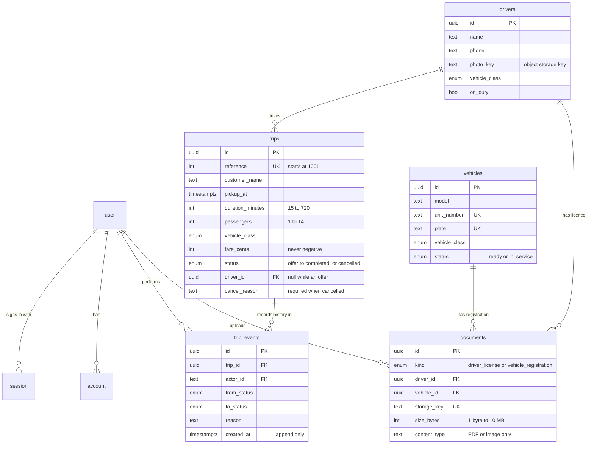
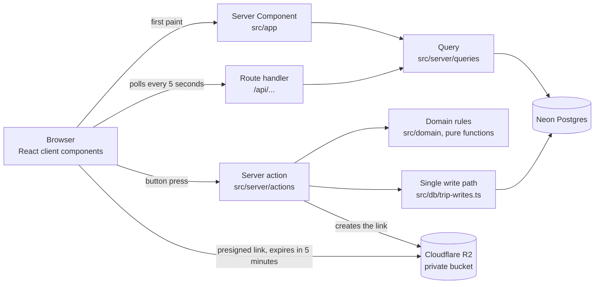

# Dispatch Lite

Dispatcher operations app for a luxury car service. See `docs/brief.md` for scope and `CLAUDE.md` for how the code is organised.

## Setup

Requirements: Node 22.19 or later, pnpm 10, and Postgres 16 running locally (the `btree_gist` and `pg_trgm` extensions ship with standard Postgres). Nothing else: file storage runs in-process on your machine for development.

```
pnpm i
cp .env.example .env
```

Set `BETTER_AUTH_SECRET` in `.env` to a random value (`openssl rand -base64 32`) and point `DATABASE_URL` at your Postgres if it is not `postgres:postgres@localhost:5432`. Then:

```
pnpm db:reset
pnpm dev
```

Open http://localhost:3000 and choose "Sign in with the demo account" (dispatcher@example.com, password from `DEMO_USER_PASSWORD`).

`pnpm db:reset` recreates the local database, applies migrations and seeds a week of fake trips. It refuses to run against anything other than localhost. `pnpm dev` also starts a local S3 compatible store on port 4568 for uploads; files land in `.storage/`.

For a load check, `pnpm db:reset --load` starts over with 100,000 extra historical trips (about two minutes).

## Checks

```
pnpm lint && pnpm typecheck && pnpm test && pnpm e2e
```

Integration tests use a separate `dispatch_test` database and e2e tests use `dispatch_e2e`. Both are recreated on every run.

## Deploying

Vercel builds with `pnpm db:deploy && pnpm build`. `db:deploy` applies migrations, then seeds the fake demo data only if the database has no drivers yet, so it is safe on every deploy and never touches data that already exists. Set the variables from `.env.example` on the Vercel project, plus `SENTRY_DSN` and `NEXT_PUBLIC_SENTRY_DSN` if you want error and trace reporting.

## Running cost

Estimated from public vendor pricing read on 2026-10-08 (prices change, so check before quoting). Totals per month, with the range in brackets:

- 20 users (about 5 dispatchers online at once): **about $40** ($40 to $102)
- 200 users (about 40 online at once): **about $162** ($102 to $306)
- Idle demo with almost no traffic: **about $40** ($0 to $41)

The biggest drivers are the Vercel Pro fee, a Neon database that the health check keeps awake, and Sentry spans from tracing every 5 second poll. Three small changes bring the three totals down to about $25, $50 and $21. The sources, assumptions and arithmetic are in [docs/cost-estimate.md](docs/cost-estimate.md).

## Adding shadcn components

Use `pnpm ui:add <component>`, not the shadcn CLI directly. The shadcn CLI sometimes adds an unrelated npm package called `cn` and imports from it; the script removes it and points the imports at `@/components/ui/utils`. Lint blocks the stray import either way.

## Database schema



The rules that matter are enforced by the database as well as the app, so they hold even if the app has a bug:

- **Status flow:** a trigger allows only `offer -> assigned -> en route -> completed`, plus `cancelled` from any step before completed. Completed and cancelled are final.
- **Driver and status agree:** an offer has no driver, and every later status has one. A cancel needs a reason.
- **No double booking:** an exclusion constraint rejects two active trips for one driver whose time ranges overlap.
- **History:** every status change writes a `trip_events` row in the same transaction, and that table cannot be edited or deleted from.
- **Documents:** a licence belongs to a driver and a registration to a vehicle, only PDFs and images, 10 MB at most.
- **Scale:** indexes on status and pickup time, driver and pickup time, and a trigram index on customer name keep search and lists fast at 100,000 trips.

## How a request flows



Reads go through a query function, called by the page for first paint and by a route handler for polling. Writes go through a server action: check the session, validate with zod, call the domain, write in one transaction. Status changes pass through `transitionTrip()` and nowhere else.

## Where to look in the code

| If you want to see | Open |
|---|---|
| The status rules | `src/domain/trip-status.ts`, then `src/db/migrations` for the database copy |
| Driver matching | `src/domain/matching.ts` and `src/domain/matching.test.ts` |
| How a write is guarded | `src/server/action.ts`, then `src/server/actions/trips.ts` |
| The single place status is written | `src/db/trip-writes.ts` |
| Live polling and optimistic updates | `src/components/live-query.ts`, `src/components/use-optimistic-action.ts` |
| How private files work | `src/server/storage.ts`, `src/app/api/documents/[id]/route.ts` |
| Rules the linter enforces | `eslint.config.mjs` and `eslint-rules/` |
| Proof the rules work | `tests/integration/trip-rules.test.ts`, `e2e/break.spec.ts` |

## Key decisions

**Why Neon, in plain terms.** Think of the production database as the master copy of a contract. Before anyone edits a contract, you want to try the change on a copy, not the original. Normally copying a large database takes minutes or hours and costs as much storage as the original, so teams skip it and test on made-up data, and that is how a change that looked fine ends up breaking real bookings.

Neon makes a "branch": an instant copy that only stores what changes. It is ready in seconds however large the database is, and it costs almost nothing until someone edits it. That gives this project three things:

1. **Every proposed change is tried on a real copy first.** Each preview deploy gets its own branch, so a reviewer can click around a working version of the app without touching the live data.
2. **Mistakes are cheap to undo.** If a change goes wrong, delete the branch. Production never knew about it. Neon can also rewind a database to a moment in the past, which is how the backup restore drill works.
3. **It scales to zero.** A branch that nobody is using costs nothing, which keeps the monthly bill small for a project this size.

The same property is why the app's local development uses a `local-dev` branch instead of a risky shared database.

## Demo walkthrough

Test cases to show, in order. Each one lists the clicks, what you should see, and the rule being proved. Use the demo account (`dispatcher@example.com`). Run the whole walkthrough once at phone width (375px, browser dev tools) and once on desktop.

Before you start, run `pnpm db:reset` so every number below starts from a known state.

### 01 Login

1. Signed out, open `/jobs`. You land on the sign in page.
2. Press "Sign in" with both fields empty. Plain language messages appear under each field.
3. Enter the demo email and a wrong password. You see "That email and password do not match."
4. Press "Sign in with the demo account". You return to the page you asked for (`/jobs`).
5. Press the sign out icon (sidebar footer on desktop, top bar on phone). You are back on the sign in page, and `/` sends you there again.

Proves: protected routes, redirects, no account guessing.

### 02 Dashboard

1. Open the dashboard. Four tiles: Active jobs, Drivers on duty, Fleet ready, Today's revenue.
2. Compare each tile with the data: drivers on duty matches the toggles on the Drivers page, Fleet ready matches the Ready vehicles on the Fleet page, revenue is the sum of today's Completed trips only.

Proves: every number comes from the database.

### 03 Jobs

1. Jobs, "New trip". Submit empty. Each field explains what is missing.
2. Enter more passengers than the vehicle class holds. The form says how many it seats.
3. Fill every field and book it. It appears at the top of Jobs as Offer.
4. "Edit" on that trip, change the fare, save. The new fare shows.
5. Search by customer name, then use the status buttons. The list narrows. "Show more" loads the next page.
6. "Cancel trip" on an offer. The dialog asks for a reason, and will not continue without one. Confirm. The trip shows Cancelled with the reason.

Proves: validation, search and filters, a safety step before anything destructive.

### 04 Assign a driver

1. Dashboard, "Needs a driver", "Assign driver" on any offer (click 1).
2. The top 3 drivers appear, with the best match first and how many trips each has that day. Every one is on duty, drives that vehicle class, and is free at that time.
3. "Assign" beside the first one (click 2). The trip moves to "Up next" as Assigned.
4. Repeat by keyboard only: Tab to "Assign driver", Enter, the best match is focused, Enter.
5. Put the best driver off duty on the Drivers page and open the suggestions for another offer. That driver is gone from the list.
6. "Reassign" on an Assigned trip. The current driver is not offered, and the others follow the same rules.

Proves: matching rules, two clicks, keyboard access.

### 05 Status updates

1. On an Assigned trip, "Start trip". It becomes En route. Open the dashboard in a second tab first and watch it change within 5 seconds, with no refresh.
2. "Complete trip". The trip becomes Completed and no further buttons are offered. Today's revenue rises by its fare. A cancelled trip never adds revenue.
3. Try to move a trip backwards or skip a step. The app never offers it, and the database also refuses it (see the integration tests in `tests/integration/trip-rules.test.ts`).

Proves: the status flow is enforced on the server and in the database, and live updates work.

### 06 Drivers

1. Drivers, "Add driver". Submit empty to see validation, then add a driver with phone and vehicle class.
2. "Profile" on that driver. Edit the phone, and upload a photo.
3. Flip the on duty switch on the list. Drivers on duty on the dashboard changes within 5 seconds.

### 07 Fleet

1. Fleet, "Add vehicle". A duplicate fleet number is explained in plain language.
2. Flip a vehicle to In service with its switch. Fleet ready on the dashboard drops by one within 5 seconds, and the schedule's vehicle class availability follows.

### 08 Schedule

1. Schedule. Trips still to run are in pickup order, grouped by hour. Finished trips are tucked behind "Show N finished trips".
2. Filter by status, then also by driver. "Clear filters" returns to the full list.

### 09 Documents

1. Drivers, "Profile", Licenses, "Upload". Pick a PDF or image under 10 MB. It shows as Uploaded, with "View" and "Delete".
2. Pick a file over 10 MB or of another type. The message says which limit it broke.
3. "View" opens it through a short lived link. Copy that link, wait 5 minutes, and it stops working.
4. Open `/api/documents/<any id>` in a private window. You are refused, because you are not signed in.
5. "Delete" asks for confirmation first.
6. Repeat for a vehicle's Registrations on the Fleet detail page.

### Stretch features

**Insights** (`/insights`)
1. Open Insights. Four tiles cover the last seven days: trips, completion rate, cancellation rate and revenue.
2. "Needs attention" lists offers due within two hours, offers whose pickup time has passed, and assigned trips not started 15 minutes after pickup. Book an offer for the next hour and it appears within 5 seconds.
3. The charts show trips per day (completed, still open, cancelled), revenue per day (completed trips only), why trips were cancelled, and trips per driver today, so an uneven load is visible at a glance.

**Activity log** (`/activity`, from the "Activity log" button on Insights)
1. Every booking, assignment, driver change, status move and cancellation is listed newest first, with who did it and the cancel reason.
2. Book a trip in another tab and the entry appears here within 5 seconds. "Show more" loads older entries.

**CSV export** (Jobs, "Export CSV")
1. Press "Export CSV" with no filters for every trip, newest first.
2. Choose a status or type a customer name first and the file contains only those trips.
3. Cells that start with `=`, `+`, `-` or `@` are prefixed with an apostrophe so a spreadsheet cannot run them as formulas.

**Theme switcher** (button beside sign out)
1. It cycles Light, Dark and Match my device. The choice survives a reload and applies before the page paints, so there is no flash.
2. On Match my device, changing the operating system theme changes the app too.

**Guided tour**
1. On a first visit a five step tour opens by itself. Next, Back, Skip tour and Escape all work.
2. The question mark button beside the theme button opens it again. Some steps link to the page they describe.

**Monitoring** (`/health`)
1. The "Error and speed monitoring" card says whether Sentry is switched on. It reads On when `SENTRY_DSN` is set and "Not set up" when it is not.
2. When it is on, "Send a test error and trace" sends one error and one timed trace. They appear in the Sentry project within a minute, which proves the alerts and the dashboard are connected.
3. Traces are sampled at 100% (`src/observability.ts`). Lower that number once traffic grows.

### Trying to break it

- **Double submit:** press "Book trip" twice fast. One trip is created.
- **Stale tab:** open one trip in two tabs. Complete it in one, then press "Complete trip" in the other. You see a plain message, not a crash.
- **Overlapping assignment:** assign two trips with overlapping times to the same driver from two tabs. The second is refused by the database.
- **Phone width:** every page above at 375px. Nothing scrolls sideways, buttons are at least 44px tall, and the bottom bar never covers content.
