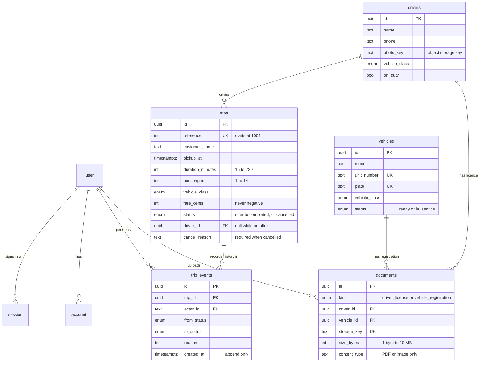
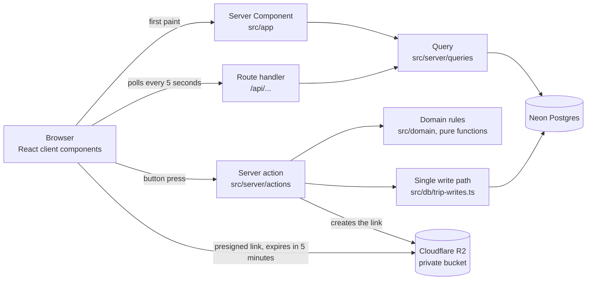

# Dispatch Lite

Dispatcher operations app for a luxury car service. See `docs/brief.md` for scope and `CLAUDE.md` for how the code is organised.

## Setup

Requirements: Node 22.19 or later, pnpm 10, and Postgres 16 running locally (the `btree_gist` and `pg_trgm` extensions ship with standard Postgres). Nothing else: file storage runs in-process on your machine for development.

```
pnpm i
cp .env.example .env
```

Set `BETTER_AUTH_SECRET` in `.env` to a random value (`openssl rand -base64 32`), set `DEMO_USER_PASSWORD` to a password of your choosing, and point `DATABASE_URL` at your Postgres if it is not `postgres:postgres@localhost:5432`. Then:

```
pnpm db:reset
pnpm dev
```

Open http://localhost:3000 and sign in as dispatcher@example.com with the password you set in `DEMO_USER_PASSWORD`.

`pnpm db:reset` recreates the local database, applies migrations and seeds a week of fake trips. It refuses to run against anything other than localhost. `pnpm dev` also starts a local S3 compatible store on port 4568 for uploads; files land in `.storage/`.

For a load check, `pnpm db:reset --load` starts over with 100,000 extra historical trips (about two minutes).

## Checks

```
pnpm lint && pnpm typecheck && pnpm test && pnpm e2e
```

Integration tests use a separate `dispatch_test` database and e2e tests use `dispatch_e2e`. Both are recreated on every run.

## Environments and storage

Three separate environments, each with its own database and its own files, so a mistake in one cannot touch another.

| Environment | Where it runs | Database | Files |
|---|---|---|---|
| Production | `main` on Vercel | Neon branch `main` | R2 bucket `dispatch-lite-production` |
| Preview | every other branch on Vercel, behind Vercel login | Neon branch `preview`, a copy of production data | R2 bucket `dispatch-lite-preview` |
| Local | your machine | local Postgres | in-process S3 on your machine |

Each environment also has its own sign-in secret, so a session from one is useless in another. Previews sign in on their own address, which the app reads from Vercel. A branch per preview needs the Neon integration for Vercel (https://vercel.com/integrations/neon); until it is installed all previews share the one `preview` branch, still isolated from production.

Documents are private. Both buckets have public access switched off and no custom domains, so a file cannot be reached by its address alone. The browser asks the app for a link, the app checks the person is signed in, and the link it returns is signed and expires after 5 minutes: uploads and views both use these short-lived links, and a signed-out request to a document is refused with a 401. Upload limits (PDF or image, 10 MB) are enforced by the app and again by the database.

## Backups and restoring

The database can be rewound to any second in the last 7 days, and a restore takes seconds. The drill, the steps and the limits (a deleted file cannot be recovered) are in `docs/backup-restore.md`.

## Deploying

Vercel builds with `pnpm db:deploy && pnpm build`. `db:deploy` applies migrations, then seeds the fake demo data only if the database has no drivers yet, so it is safe on every deploy and never touches data that already exists. It also keeps the demo account's password in step with `DEMO_USER_PASSWORD`: change the variable and redeploy, and the old password stops working and everyone signed in with it is signed out. The demo password lives only in that variable and in the submission message; the app never reads it and the sign in page never shows it. Set the variables from `.env.example` on the Vercel project, plus `SENTRY_DSN` and `NEXT_PUBLIC_SENTRY_DSN` if you want error and trace reporting.

## Running cost

Estimated from public vendor pricing read on 2026-10-08 (prices change, so check before quoting). Totals per month, with the range in brackets:

- 20 users (about 5 dispatchers online at once): **about $30** ($30 to $93)
- 200 users (about 40 online at once): **about $152** ($92 to $297)
- Idle demo with almost no traffic: **about $27** ($0 to $28)

The biggest drivers are the Vercel Pro fee, Neon compute that polling keeps awake during shifts, and Sentry spans from tracing every 5 second poll at 100 percent (deliberate for now). Once real traffic arrives, lowering the trace sampling rate brings the 200 user figure down to about $55. The 15 minute interval on the database health check already saves about $10 a month compared with checking every 3 minutes. The sources, assumptions and arithmetic are in [docs/cost-estimate.md](docs/cost-estimate.md). Database restore steps are in `docs/backup-restore.md`.


### In plain terms

Think of running the app like running a small office. Five services keep it going, and most of the bill is two of them.

| Service | What it is, in office terms | 20 users | 200 users |
|---|---|---|---|
| Vercel | The building the app lives in, and the staff who serve every page | $20 | $40 |
| Neon | The filing cabinet that holds every trip, driver and booking, with a rewind button | about $10 | about $15 |
| Cloudflare R2 | A locked safe for licences and registrations | $0 | $0 |
| Sentry | A smoke alarm that tells us when something breaks and how slow pages are | $0 | about $97 |
| Better Stack | A doorbell check every few minutes that the site is open | $0 | $0 |
| **Monthly total** | | **about $30** | **about $152** |

How to read it:
- **A quiet demo costs about $27 a month.** Almost all of that is the building and the filing cabinet.
- **The jump at 200 users is almost all the smoke alarm.** It records every refresh of every screen. Telling it to record one refresh in ten, which we would do once real traffic arrives, brings the 200 user bill to about $55.
- **Files are almost free.** The safe stays free until it holds about 10 GB, which is tens of thousands of documents.
- **A 100,000 trip history is tiny.** It takes about 130 MB, which costs a few cents a month.
- **Not included:** the one time build fee, a web address of your own (about $12 a year), and any extra seats for people who deploy changes.

These are estimates from the vendors' public price lists on 2026-10-08. Prices change, so check before quoting.

## Adding shadcn components

Use `pnpm ui:add <component>`, not the shadcn CLI directly. The shadcn CLI sometimes adds an unrelated npm package called `cn` and imports from it; the script removes it and points the imports at `@/components/ui/utils`. Lint blocks the stray import either way.

## What was asked, and where it is

Live app: https://dispatch-lite-ruby.vercel.app (demo login in the submission message).

**Nine required features**

| No. | Feature | Where to see it |
|---|---|---|
| 01 | Login | Any page while signed out sends you to sign in; sign out icon in the menu |
| 02 | Dashboard | `/`, four live tiles that match the database |
| 03 | Jobs | `/jobs`, create, edit, cancel with a reason, search by customer or trip number, status filters |
| 04 | Assign driver | "Assign driver" on any offer: top 3 matches, two clicks, works by keyboard |
| 05 | Status updates | "Start trip" and "Complete trip"; the dashboard updates within 5 seconds |
| 06 | Drivers | `/drivers`, add and edit with photo, phone, class and an on duty switch |
| 07 | Fleet | `/fleet`, Ready or In service; changes the Fleet ready tile |
| 08 | Schedule | `/schedule`, today's trips on a timeline in time order, one chart row per driver with a now line, filter by driver and status |
| 09 | Documents | Driver licences and vehicle registrations, PDF or image up to 10 MB, signed-in only |

**Stretch goals**

| Stretch goal | Status | Where to see it |
|---|---|---|
| Live updates across two tabs | Done | Open the dashboard in two tabs and move a trip in one |
| Seven day volume chart and revenue report | Done | `/insights`: trips per day, revenue per day, cancellation reasons, driver load. The revenue report is the revenue chart and weekly total, not a printable report |
| Theme switcher | Done | Sun or moon button beside sign out (light and dark) |
| Guided first time tour | Done | Opens on a first visit and highlights the part of the app each step describes; question mark button reopens it |
| CSV export of trips | Done | "Export CSV" on Jobs, follows the search and status on screen |
| Activity log | Done | `/activity`, who changed which trip and when |
| Automated tests on the matching logic | Done | `src/domain/matching.test.ts`, plus mutation testing on the domain code |
| Keyboard shortcuts | Done | Press `?` for the list; `g` then a letter jumps between pages |

**Infrastructure and storage**

| Criterion | Status | Evidence |
|---|---|---|
| Managed hosting, automatic deploys | Done | Vercel deploys every push; production from `main` |
| Separate environments | Done | Production, preview and local each have their own database and files |
| Private documents on expiring links | Done, checked by hand on the live site | Private buckets, signed links that expire after 5 minutes |
| Migrations and indexes for 100,000 trips | Indexes and paging in place; not load tested | See "Scale" under Database schema |
| Backups you can restore | Done | `docs/backup-restore.md`, with a recorded drill |
| Clear monthly cost estimate | Done | "Running cost" below, and `docs/cost-estimate.md` |

**Deliverables**

| Deliverable | Status |
|---|---|
| Live URL and demo login | Done |
| GitHub repo with real history | Done |
| README | Done |
| Video walkthrough | To record. The demo walkthrough below is the script |
| Time log and AI disclosure | `docs/time-log.md`; hours still to be filled in |
| Price quote and salary expectations | Written separately |

Known gaps: the Sentry alert for slow requests has to be created in the Sentry screen, preview deployments share one database branch until the Neon integration for Vercel is installed, and the cost figures are estimates from public pricing.

## Database schema



The rules that matter are enforced by the database as well as the app, so they hold even if the app has a bug:

- **Status flow:** a trigger allows only `offer -> assigned -> en route -> completed`, plus `cancelled` from any step before completed. Completed and cancelled are final.
- **Driver and status agree:** an offer has no driver, and every later status has one. A cancel needs a reason.
- **No double booking:** an exclusion constraint rejects two active trips for one driver whose time ranges overlap.
- **Right class:** triggers keep an assigned or en route trip in its driver's vehicle class. A trip cannot go to a driver of another class, and a driver's class cannot change while they hold such a trip.
- **History:** every status change writes a `trip_events` row in the same transaction, and that table cannot be edited or deleted from.
- **Documents:** a licence belongs to a driver and a registration to a vehicle, only PDFs and images, 10 MB at most.
- **Scale:** indexes on status and pickup time, driver and pickup time, and a trigram index on customer name are in place for 100,000 trips. Lists are paged and the polling queries only read recent days. This has not been load tested; `pnpm db:reset --load` builds a 100,000 trip database for anyone who wants to measure it.

## How a request flows



Reads go through a query function, called by the page for first paint and by a route handler for polling. Every query is declared with `defineQuery`, which checks that the session is real (Better Auth verifies it, not just that a cookie is present) before it reads, and sends anyone else to sign in. Next renders a page alongside its layout, so the layout's sign-in check alone could let a page load its data first; checking inside the query closes that gap, and a lint rule fails any query exported without it. The proxy in `src/proxy.ts` is only a quick first filter for visitors with no cookie at all. Writes go through a server action: check the session, validate with zod, call the domain, write in one transaction. Status changes pass through `transitionTrip()` and nowhere else.

## Where to look in the code

| If you want to see | Open |
|---|---|
| The status rules | `src/domain/trip-status.ts`, then `src/db/migrations` for the database copy |
| Driver matching | `src/domain/matching.ts` and `src/domain/matching.test.ts` |
| How a read is guarded | `src/server/query.ts`, then any file in `src/server/queries` |
| How a write is guarded | `src/server/action.ts`, then `src/server/actions/trips.ts` |
| The single place status is written | `src/db/trip-writes.ts` |
| Live polling and optimistic updates | `src/components/live-query.ts`, `src/components/use-optimistic-action.ts` |
| How private files work | `src/server/storage.ts`, `src/app/api/documents/[id]/route.ts` |
| Rules the linter enforces | `eslint.config.mjs` and `eslint-rules/` |
| Proof the rules work | `tests/integration/trip-rules.test.ts`, `e2e/break.spec.ts`, `e2e/access.spec.ts` |

## Key decisions

**Why Neon, in plain terms.** Think of the production database as the master copy of a contract. Before anyone edits a contract, you want to try the change on a copy, not the original. Normally copying a large database takes minutes or hours and costs as much storage as the original, so teams skip it and test on made-up data, and that is how a change that looked fine ends up breaking real bookings.

Neon makes a "branch": an instant copy that only stores what changes. It is ready in seconds however large the database is, and it costs almost nothing until someone edits it. That gives this project three things:

1. **Every proposed change is tried on a real copy first.** Preview deploys run on their own branch of the database, separate from production, so a reviewer can click around a working version of the app without touching the live data. Today all previews share one `preview` branch; the Neon integration for Vercel would give each preview its own.
2. **Mistakes are cheap to undo.** If a change goes wrong, delete the branch. Production never knew about it. Neon can also rewind a database to a moment in the past, which is how the backup restore drill works.
3. **It scales to zero.** A branch that nobody is using costs nothing, which keeps the monthly bill small for a project this size.

The same property gives local development a safe option: work against a local Postgres, or against a `local-dev` branch of the Neon database, never against production.

## Known issues

- Uploads and views were checked by hand on the live site against the private production bucket (a driver photo, viewed through a signed link that expires after 5 minutes). Licence and registration uploads use the same code path and are covered by the automated tests.
- Sentry's slow request alert has to be created in the Sentry screen. The new error and regression alerts are in place.
- Every preview deployment shares one Neon database branch, `preview`. A fresh branch per pull request needs the Neon integration for Vercel.
- The 100,000 trip claim comes from indexes, paging and bounded queries. It has not been load tested.
- Deleting a document deletes its file for good, because R2 cannot undelete. The database row can be rewound but the file cannot.
- Pickup and drop off are free text addresses.
- Cost figures are estimates from public price lists and depend on a few assumptions, listed in `docs/cost-estimate.md`.

## What to build next

1. **Real addresses with a maps service.** Pickup and drop off become searchable, verified places with coordinates instead of free text. That gives a map on each trip, real travel times, and fewer wrong addresses. It needs a maps provider and an API key, so it is a deliberate choice of service and cost.
2. **Calling and messaging drivers from the app.** Drivers already have a tap to call link that opens the phone's dialer. The next step is calling through the app with masked numbers, so neither side sees the other's personal number, plus a log of calls per trip and a text to the driver with the trip details when they are assigned.
3. **Smarter driver matching.** Today the top three are on duty, drive the right class, are free at that time, and have the fewest trips that day. With real locations from step 1 the ranking can also weigh how close the driver will be when the trip starts (where their previous drop off ends), a buffer for travel between trips, a client's preferred driver for VIP accounts, and shift end times, so nobody is booked past their shift.
4. A photo for each vehicle, using the same private upload as driver photos.
5. A week view of the schedule alongside the day timeline.
6. A branch per preview using the Neon integration for Vercel, and a soft delete for documents so a removed file can be recovered for 30 days.

## Demo walkthrough

Test cases to show, in order. Each one lists the clicks, what you should see, and the rule being proved. Use the demo account (`dispatcher@example.com`). Run the whole walkthrough once at phone width (375px, browser dev tools) and once on desktop.

Before you start, run `pnpm db:reset` so every number below starts from a known state.

### 01 Login

1. Signed out, open `/jobs`. You land on the sign in page.
2. Press "Sign in" with both fields empty. Plain language messages appear under each field.
3. Enter the demo email and a wrong password. You see "That email and password do not match."
4. Enter the demo password from the submission message and press "Sign in". You return to the page you asked for (`/jobs`).
5. Press the sign out icon (sidebar footer on desktop, top bar on phone). You are back on the sign in page, and `/` sends you there again.

Proves: protected routes, redirects, no account guessing. `e2e/access.spec.ts` also sends a made up session cookie to every page and API route and checks that none of the seeded data comes back.

### 02 Dashboard

1. Open the dashboard. Four tiles: Active jobs, Drivers on duty, Fleet ready, Today's revenue.
2. Compare each tile with the data: active jobs is today's Assigned trips plus every trip En route (a trip in progress stays live whatever its pickup date), drivers on duty matches the toggles on the Drivers page, Fleet ready matches the Ready vehicles on the Fleet page, revenue is the sum of today's Completed trips only.

Proves: every number comes from the database.

### 03 Jobs

1. Jobs, "New trip". Submit empty. Each field explains what is missing.
2. Enter more passengers than the vehicle class holds. The form says how many it seats.
3. Fill every field and book it. It appears at the top of Jobs as Offer.
4. "Edit" on that trip, change the fare, save. The new fare shows.
5. Search by customer name, then use the status buttons. The list narrows. "Show more" loads the next page.
6. Clear the search and type a trip number from any card or toast, as `1234` or `#1234`. Exactly that trip shows, however old it is, and the status buttons still narrow it.
7. "Cancel trip" on an offer. The dialog asks for a reason, and will not continue without one. Confirm. The trip shows Cancelled with the reason.

Proves: validation, search and filters, a safety step before anything destructive.

### 04 Assign a driver

1. Dashboard, "Needs a driver", "Assign driver" on any offer (click 1).
2. The top 3 drivers appear, with the best match first and how many trips each has that day. Every one is on duty, drives that vehicle class, and is free at that time.
3. "Assign" beside the first one (click 2). The trip moves to "Up next" as Assigned.
4. Repeat by keyboard only: Tab to "Assign driver", Enter, the best match is focused, Enter.
5. Put the best driver off duty on the Drivers page and open the suggestions for another offer. That driver is gone from the list.
6. "Reassign" on an Assigned trip. The current driver is not offered, and the others follow the same rules.

Proves: matching rules, two clicks, keyboard access.

### 05 Status updates

1. On an Assigned trip, "Start trip". It becomes En route. Open the dashboard in a second tab first and watch it change within 5 seconds, with no refresh.
2. "Complete trip". A dialog asks first, because completing is final and counts toward revenue; "Not yet" (or Escape) backs out. Confirm with "Complete trip". The trip becomes Completed and no further buttons are offered. Today's revenue rises by its fare. A cancelled trip never adds revenue.
3. Try to move a trip backwards or skip a step. The app never offers it, and the database also refuses it (see the integration tests in `tests/integration/trip-rules.test.ts`).

Proves: the status flow is enforced on the server and in the database, and live updates work.

### 06 Drivers

1. Drivers, "Add driver". Submit empty to see validation, then add a driver with phone and vehicle class.
2. "Profile" on that driver. Edit the phone, and upload a photo.
3. Flip the on duty switch on the list. Drivers on duty on the dashboard changes within 5 seconds.

### 07 Fleet

1. Fleet, "Add vehicle". A duplicate fleet number is explained in plain language.
2. Flip a vehicle to In service with its switch. Fleet ready on the dashboard drops by one within 5 seconds, and the schedule's vehicle class availability follows.

### 08 Schedule

1. Schedule. "Day at a glance" draws every trip today as a bar on one row per driver, placed and sized by its pickup and end time, so free time and overlapping bookings show to scale. Trips that still need a driver get the top row. A gold line marks the current time and moves with the clock; on a phone the chart opens scrolled to it.
2. Below it, the timeline lists the same trips in pickup order, each with its start and end time, duration, customer, status, driver and vehicle class. A "Now" marker sits between trips already picked up and those still to come, and "Jump to now" scrolls to it. Finished trips stay in their place in a smaller card.
3. Tap a bar on the chart to jump to that trip's card. `j` and `k` step through the cards; Tab reaches each card's buttons.
4. Start, complete, assign or cancel a trip from its card, as on the dashboard.
5. Filter by status, then also by driver. The choice is kept in the address, so a refresh or a shared link shows the same view. "Clear filters" returns to the full day.

### 09 Documents

1. Drivers, "Profile", Licenses, "Upload". Pick a PDF or image under 10 MB. It shows as Uploaded, with "View" and "Delete".
2. Pick a file over 10 MB or of another type. The message says which limit it broke.
3. "View" opens it through a short lived link. Copy that link, wait 5 minutes, and it stops working.
4. Open `/api/documents/<any id>` in a private window. You are refused, because you are not signed in.
5. "Delete" asks for confirmation first.
6. Repeat for a vehicle's Registrations on the Fleet detail page.

### Stretch features

**Insights** (`/insights`)
1. Open Insights. Four tiles cover the last seven days: trips, completion rate, cancellation rate and revenue.
2. "Needs attention" lists offers due within two hours, offers whose pickup time has passed, and assigned trips not started 15 minutes after pickup. Book an offer for the next hour and it appears within 5 seconds.
3. The charts show trips per day (completed, still open, cancelled), revenue per day (completed trips only), why trips were cancelled, and trips per driver today, so an uneven load is visible at a glance.

**Activity log** (`/activity`, from the "Activity log" button on Insights)
1. Every booking, assignment, driver change, status move and cancellation is listed newest first, with who did it and the cancel reason.
2. Book a trip in another tab and the entry appears here within 5 seconds. "Show more" loads older entries.

**CSV export** (Jobs, "Export CSV")
1. Press "Export CSV" with no filters for every trip, newest first.
2. Choose a status or type a customer name or trip number first and the file contains only those trips.
3. Cells that start with `=`, `+`, `-` or `@` are prefixed with an apostrophe so a spreadsheet cannot run them as formulas.

**Theme switcher** (button beside sign out)
1. It flips between Light and Dark. The choice survives a reload and applies before the page paints, so there is no flash.
2. Until you choose, the app starts in whichever theme your device prefers. Once you choose, your choice always wins over the device.

**Guided tour**
1. On a first visit a six step tour opens by itself. Each step rings the part of the app it describes. Next, Back, Skip tour and Escape all work.
2. The question mark button beside the theme button opens it again. Some steps link to the page they describe.

**Keyboard** (keyboard button beside the question mark button, or press `?`)
1. Press `?` anywhere outside a field to list every shortcut. `Esc` closes the list.
2. Go to a page with two keys in a row: `g` then `d` Dashboard, `j` Jobs, `s` Schedule, `r` Drivers, `f` Fleet, `i` Insights, `a` Activity log. A wrong second key, or waiting 1.5 seconds, cancels it.
3. `n` books a new trip. `/` jumps to the Jobs search box (from another page it opens Jobs first). `j` and `k` step between trip cards, and Tab then reaches that card's buttons.
4. Shortcuts stay quiet while you type in a field, while a dialog or menu is open, and when Ctrl, Cmd or Alt is held, so browser and screen reader keys keep working.
5. Open the list and turn off "Use keyboard shortcuts" if single keys get in the way. The choice is remembered in this browser.
6. Assign a driver with no mouse: `g` `d`, `j` to focus the first trip under "Needs a driver", Tab to "Assign driver", Enter, Enter on the best match. Focus lands back on that trip card.

**Monitoring** (`/health`)
1. The "Error and speed monitoring" card says whether Sentry is switched on. It reads On when `SENTRY_DSN` is set and "Not set up" when it is not.
2. When it is on, "Send a test error and trace" sends one error and one timed trace. They appear in the Sentry project within a minute, which proves the alerts and the dashboard are connected.
3. Traces are sampled at 100% (`src/observability.ts`). Lower that number once traffic grows.

### Trying to break it

- **Double submit:** press "Book trip" twice fast. One trip is created.
- **Stale tab:** open one trip in two tabs. Complete it in one, then press "Complete trip" in the other and confirm. You see a plain message, not a crash.
- **Overlapping assignment:** assign two trips with overlapping times to the same driver from two tabs. The second is refused by the database.
- **Phone width:** every page above at 375px. Nothing scrolls sideways, buttons are at least 44px tall, and the bottom bar never covers content.
